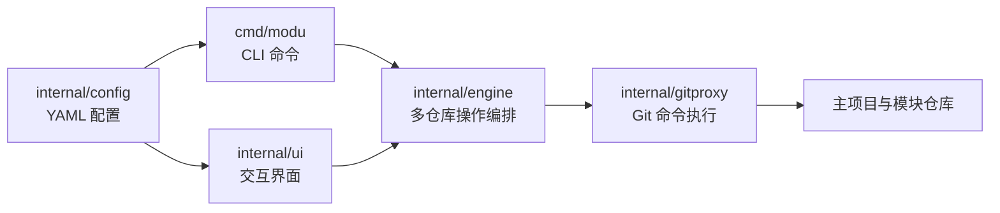

# modu

**把一个需求涉及的多个 Git 仓库，组织成一套独立的开发环境。**

modu 是一个多仓库 Git Worktree 管理工具。它为主项目和选中的模块创建同名分支，将这些 worktree 放在同一个 feature 目录下，方便同时推进多个需求。你可以使用 CLI 批量操作，也可以在终端交互界面（TUI）中选择模块、查看状态和打开编辑器。

- **按需求组织代码**：一次创建主项目与多个模块的 worktree，复用各仓库的 Git 历史。
- **按需选择模块**：只带上本次需要修改的仓库，支持在 TUI 中增删模块。
- **接手已推送的需求**：给出 feature 分支名，自动发现相关模块并按需克隆、创建 worktree。
- **集中查看与更新**：汇总分支和未提交修改，并发执行克隆、fetch 和 rebase。
- **衔接开发工具**：生成 VS Code workspace，支持复制路径及打开 Codex、Zed 等应用。

[安装](#安装) · [快速开始](#快速开始) · [日常使用](#日常使用) · [配置参考](#配置参考) · [TUI](#tui) · [脚本与大型工作区](#脚本与大型工作区) · [常见问题](#常见问题) · [开发与发布](#开发与发布)

## 安装

### Homebrew

```bash
brew tap qimaotech/modu
brew install modu
modu version
```

### Go 安装

需要 Go 1.25+，并将 Go 的二进制安装目录加入 `PATH`：

```bash
go install github.com/qimaotech/modu/cmd/modu@latest
modu version
```

运行时需要 `git` 位于 `PATH` 中，并已配置好目标仓库的 SSH 或 HTTPS 访问权限。发布构建覆盖 macOS、Linux 的 amd64 和 arm64；TUI 中的 Codex 和自定义 App 打开功能使用 macOS 的 `open -a`，VS Code 打开功能依赖 `code` 命令。

## 快速开始

### 1. 准备主项目和配置

modu 使用三个概念：

| 概念 | 含义 |
| --- | --- |
| 主项目（`workspace`） | 一个有提交历史的 Git 工作目录，可以存放共享配置、脚本和文档；模块仓库放在它的直接子目录中 |
| 模块（`modules`） | 独立的 Git 仓库，例如前端、后端或某个服务；`name` 同时决定本地目录名 |
| Feature 环境 | 主项目与所选模块的一组 worktree，集中放在 `worktree-root` 下 |

在已有主项目根目录创建 `.modu.yaml`。下面以主项目和前端使用 `develop`、后端使用 `main` 为例；请替换仓库地址，并按实际情况修改基准分支：

```yaml
workspace: .
worktree-root: ../worktrees
default-base: develop
concurrency: 5
strict-dirty-check: true

modules:
  - name: frontend
    url: "<frontend 仓库的 Git 地址>"
  - name: backend
    url: "<backend 仓库的 Git 地址>"
    base-branch: main
```

`workspace` 必须是主项目自身的 Git 仓库根目录。创建 feature 前，主项目和各模块需要有可用的基准分支；使用 `update` 同步代码时，还需要配置 `origin` 及对应远端分支。

还没有主项目时，可以运行 `modu config create`，按向导选择目录和基准分支。向导会保存配置，必要时初始化主项目仓库并创建初始提交；随后编辑配置填写模块地址，或按下方说明扫描已有模块。

### 2. 初始化模块

在 `.modu.yaml` 所在的主项目根目录执行：

```bash
# 克隆配置中的模块；已存在且有效的仓库会跳过
modu init
```

`init` 会把模块克隆到 `workspace/<模块名>`，并把模块目录加入主项目的 `.gitignore`。检查并提交需要共享的配置、`.gitignore` 等变更后，新 worktree 才会包含这些内容。

保持工作目录干净，再将主项目和模块同步到各自的基准分支：

```bash
modu update
```

如果模块已经克隆到主项目的直接子目录中，可以先创建配置，再在**主项目根目录**运行 `modu config scan` 自动登记模块。扫描读取当前目录下各仓库的 `origin`，按仓库地址去重；它不会递归扫描，也不会克隆仓库。

还没有配置或 `modules` 为空时，也可以在主项目根目录直接扫描并初始化：

```bash
modu init --scan
```

首次执行会生成默认配置，基准分支为 `develop`，请按实际仓库调整。已有非空模块列表时，`init --scan` 不会追加扫描；发现后来加入的仓库请使用 `modu config scan`。

### 3. 创建一套开发环境

```bash
modu create feature/order-export --modules frontend,backend
modu info feature/order-export
modu list --status
```

创建后的目录如下：

```text
workspace/
├── main/                              # workspace：主项目原始工作目录
│   ├── .git/
│   ├── .modu.yaml
│   ├── frontend/                      # 模块原始仓库
│   └── backend/
└── worktrees/                         # worktree-root
    └── feature-order-export/          # 主项目的 worktree
        ├── .git                       # 指向主项目仓库的 Git 文件
        ├── frontend/                  # frontend 的 worktree
        ├── backend/                   # backend 的 worktree
        └── feature-order-export.code-workspace
```

分支名保留 `feature/order-export`，目录名中的 `/` 会替换为 `-`。在各模块 worktree 中照常编辑、提交和推送，即可保留主工作目录及其他需求的开发现场。

### 4. 使用交互界面

```bash
modu
# 或显式启动
modu tui
```

选择主项目或 feature 后，按 Enter 打开操作菜单；按 `n` 新建 feature，按 `m` 管理所选 feature 的模块。

配置不存在时，`modu tui` 会打开配置向导，保存后退出；补齐模块配置后再次启动即可。直接运行 `modu` 遇到缺失配置时会报错并提示创建配置。

如果要接手他人已推送的需求，可在准备好主项目和模块配置后直接使用 [`modu checkout <feature>`](#接手已推送的需求)，自动发现相关模块，无需先运行 `init`。

## 日常使用

### 命令速查

| 命令 | 用途 |
| --- | --- |
| `modu init` | 克隆配置中的模块仓库 |
| `modu init --scan` | 无配置或模块列表为空时，先扫描已有仓库再初始化 |
| `modu create <feature>` | 创建主项目及所选模块的 worktree |
| `modu checkout <feature>` | 按远端同名分支自动接手主项目与相关模块，缺失的模块按需克隆 |
| `modu list` | 列出 feature、路径和模块分支 |
| `modu list -a` / `modu list --all` | 额外显示原始 workspace 及模块的分支 |
| `modu list -s` / `modu list --status` / `modu status` | 显示各 feature 中模块的 clean / dirty 状态 |
| `modu info [feature]` | 查看单个 feature 的主项目、模块及状态 |
| `modu update [feature]` | 更新指定或从当前目录推断的 feature；其他位置更新原始 workspace |
| `modu delete <feature>` | 删除 feature 目录、worktree 及匹配的本地分支 |
| `modu default-select` | 设置 CLI 创建时默认勾选的模块 |
| `modu config` | 查看配置管理的子命令 |
| `modu config create` | 创建配置；交互终端中进入向导 |
| `modu config scan` | 扫描当前目录的直接子目录，登记已有仓库 |
| `modu tui` / `modu` | 打开 TUI |
| `modu version` | 查看版本、构建提交和运行平台 |
| `modu help [command]` | 查看完整帮助，支持 `modu help config create` 这样的命令路径 |
| `modu completion <shell>` | 生成 Bash、Zsh、Fish 或 PowerShell 的补全脚本 |

通用参数：

| 参数 | 用途 |
| --- | --- |
| `-c` / `--config` | 指定配置文件路径，默认读取当前目录的 `.modu.yaml` |
| `-o` / `--output` | 选择支持结构化输出命令的结果格式，默认 `text`，可选 `json` |
| `-h` / `--help` | 显示当前命令的帮助 |

`list --verbose` / `list -v` 当前虽显示在帮助中，但尚未影响输出；查看 clean / dirty 状态请使用 `--status` / `-s`。

### 帮助与 Shell 补全

```bash
modu help
modu help checkout
modu config create --help
```

`completion` 由 CLI 框架提供，用于生成补全脚本：

| 命令 | 目标 Shell |
| --- | --- |
| `modu completion bash` | Bash，需要先安装并加载 `bash-completion` |
| `modu completion zsh` | Zsh，需要启用 `compinit` |
| `modu completion fish` | Fish |
| `modu completion powershell` | PowerShell |

四种补全命令均支持 `--no-descriptions`，用于关闭补全项的说明文字。例如，在当前 Zsh 会话启用补全：

```zsh
autoload -U compinit
compinit
source <(modu completion zsh)
```

在已加载 `bash-completion` 的 Bash 会话中：

```bash
source <(modu completion bash)
```

需要持久启用，或使用 Fish / PowerShell 时，可运行对应命令的 `--help` 查看加载方式。生成补全脚本不需要 `.modu.yaml`。

### 选择模块与基准分支

```bash
# 在终端中交互选择模块
modu create feature/order-export

# 为另一个需求明确指定模块和基准分支
modu create fix/login --base main --modules backend
```

在交互式终端中，未传 `--modules` 时会打开模块选择器：空格勾选，Enter 确认。已有模块、远端已有同名分支的模块、默认选中模块会被预选；其他模块需要手动选择。非交互式环境中省略 `--modules` 会使用全部配置模块，脚本中建议显式指定。

创建新分支时，主项目使用 `--base`，未指定则使用 `default-base`；模块的优先级为 **`base-branch` > `--base` > `default-base`**。创建前应在原始主项目目录运行 `modu update`，以更新本地基准分支。

模块已有同名本地分支时会复用；仅远端存在时，会创建跟踪 `origin/<feature>` 的本地分支。Git 不允许同一分支同时被多个 worktree 检出：主项目分支被占用时创建失败，模块分支被占用时该模块会被跳过。

已有 feature 的模块增删建议使用 TUI 的 `m` 操作，完成后会更新 `.code-workspace` 文件。

### 接手已推送的需求

研发将主项目和相关模块的同名 feature 分支推送后，测试或其他协作者只需提供分支名：

```bash
# 在已配置 .modu.yaml 的主项目根目录执行，无需先运行 init
modu checkout feature/order-query

# 查看自动发现并创建的环境
modu info feature/order-query

# 研发推送修复后，同步后续提交
modu update feature/order-query
```

首次使用时先克隆主项目，配置本机的 `workspace`、`worktree-root` 和完整的 `modules` 仓库列表。主项目 worktree 位于 `worktree-root/feature-order-query/`，相关模块位于其中各自的子目录；新建的本地分支跟踪对应仓库的 `origin/feature/order-query`。

`checkout` 不需要指定模块或基准分支，按以下规则接手：

- **发现范围**：主项目的 `origin` 必须存在该分支；只纳入配置中远端存在同名分支的模块，忽略默认模块选择、`default-base` 和 `base-branch`。没有该分支的运行依赖需要另行准备。
- **按需克隆**：已初始化模块查询其实际 `origin`；未初始化模块查询配置中的 `url`，匹配到分支后才克隆。
- **查询失败**：网络、权限等错误会报告具体仓库和原因，全部查询成功后才开始创建 worktree。
- **重复执行**：只补齐缺失 worktree，保留已有目标 worktree 的本地提交和未提交修改；同步新提交使用 `update`。
- **本地冲突**：未挂载的本地同名分支仅在提交与远端一致时复用；提交不同、分支被其他 worktree 占用或目标目录冲突时会报错。
- **失败重试**：创建阶段部分失败时保留已完成的仓库，处理问题后可重试。

| 开发阶段 | 命令 |
| --- | --- |
| 从基准分支开始新需求 | `modu create <feature>` |
| 接手远端已推送的需求 | `modu checkout <feature>` |
| 同步已有环境的后续提交 | `modu update <feature>` |

### 更新代码

| 命令 | 更新范围 | 分支行为 |
| --- | --- | --- |
| 在 feature 或其子目录中执行 `modu update` | 从当前目录推断出的 feature 及其中已存在的配置模块 | 保持各仓库当前分支，fetch 后 rebase 到 `origin/<当前分支>` |
| 在原始 workspace 或其他位置执行 `modu update` | 原始主项目和已存在的配置模块 | 主项目切换到 `default-base`；模块切换到 `base-branch` 或 `default-base`，同步对应的 `origin` 分支 |
| `modu update feature/order-export` | 显式指定的 feature 及其中已存在的配置模块 | 优先使用指定的 feature，保持各仓库当前分支并同步对应的 `origin` 分支 |

目录推断与 `info` 使用相同规则，支持 feature 根目录、模块子目录及符号链接。例如，在 feature 的后端目录中更新整套需求环境：

```bash
modu update -c /absolute/path/to/main/.modu.yaml
```

在 `worktree-root` 本身或无法推断 feature 的目录中，无参数调用保留更新原始 workspace 的行为。原始 workspace 及其模块即使位于 `worktree-root` 下，也按主项目更新。配置文件仍需通过当前目录或 `-c` 定位。

更新前请提交修改，或使用 `git stash` 保存。Feature 更新要求远端存在对应分支；新建分支需先自行推送。发生 rebase 冲突时，在报错仓库中解决冲突后执行 `git rebase --continue`，或使用 `git rebase --abort` 撤销该仓库本次 rebase。

### 查看当前环境

在 feature 或其模块子目录中，可以省略 feature 参数，但仍需提供可定位的配置文件：

```bash
modu info -c /absolute/path/to/main/.modu.yaml
```

配置默认从**当前目录**读取 `.modu.yaml`，不会自动向父目录查找。跨目录操作时，建议始终用 `-c` 指向原始主项目的配置，避免 worktree 中复制的相对路径配置指向其他位置。

### 删除环境

```bash
modu delete feature/order-export
```

删除会移除整个 feature 目录，并尝试删除名称与该目录匹配的本地分支；远端分支保留。删除前请保存主项目及模块中需要保留的内容。

| 选项 | 作用 |
| --- | --- |
| 默认行为 | `strict-dirty-check: true` 时检查模块的未提交修改；另外检查待删除分支是否已推送 |
| `--force` / `-f` | 跳过模块脏检查，仍会检查未推送分支 |
| `--allow-unpushed` | 允许删除未推送的本地分支，仍受模块脏检查约束 |

两项放行选项彼此独立。当前脏检查针对配置中的模块，**主项目 worktree 根目录的修改需要自行检查**。远端不存在同名分支、存在未推送提交或无法完成远端检查时，都可能需要先处理后再删除。

## 配置参考

### 路径与字段

`workspace` 和 `worktree-root` 支持绝对路径、相对于配置文件目录的路径，以及 `$VAR` / `${VAR}` 环境变量：

```yaml
workspace: ${HOME}/workspace/main
worktree-root: ${HOME}/workspace/worktrees
```

环境变量未定义时会报错。YAML 中的 `~` **不会展开为用户主目录**，请使用 `${HOME}` 或绝对路径。`worktree-root` 建议放在主项目目录之外。

| 字段 | 必填 | 说明 |
| --- | --- | --- |
| `workspace` | 是 | 主项目 Git 工作目录；模块位于其直接子目录中 |
| `worktree-root` | 是 | Feature 环境的父目录 |
| `default-base` | 是 | 主项目默认基准分支；向导和配置生成命令默认填写 `develop` |
| `modules` | 是 | 模块列表；正常使用至少配置一个模块，扫描前可为空 |
| `concurrency` | 否 | 并发上限，默认 5；建议使用正整数 |
| `strict-dirty-check` | 否 | 删除模块前检查未提交修改；生成配置时为 `true`，手写配置省略时为 `false`，建议显式开启 |
| `default-selected-modules` | 否 | 创建时预先勾选的模块名列表 |
| `app-openers` | 否 | TUI 操作菜单中的 macOS App 打开工具 |
| `auto-fetch` | 否 | 当前可保存此字段，但 Git 操作尚未使用它作为开关；设为 `false` 也不会禁用 fetch |

模块字段：

| 字段 | 用途 |
| --- | --- |
| `name` | 模块名与目录名，应与 workspace 下的仓库目录一致 |
| `url` | 初始化及远端分支查询使用的 Git 仓库地址 |
| `base-branch` | 可选，覆盖模块的基准分支 |

### 默认选中模块

可以在 `.modu.yaml` 中为团队设置：

```yaml
default-selected-modules:
  - frontend
  - backend
```

个人偏好可用 `modu default-select` 设置。使用标准 `.modu.yaml` 文件名时，该命令保存到同目录的 `extension.yaml`；CLI 加载时，非空的个人选择会覆盖主配置中的列表。当前 TUI 直接使用 `.modu.yaml` 中的设置。

使用 `default-select` 时请保留 `.modu.yaml` 文件名：当前扩展配置路径通过字符串替换生成，改用 `config.yaml` 这类不含 `.modu.yaml` 的文件名会导致扩展配置与主配置路径重合。

### 在脚本中生成配置

`config create` 在交互式终端中优先进入向导；需要按参数生成配置时，使用空管道输入：

```bash
printf '' | modu config create \
  --workspace . \
  --worktree-root ../worktrees \
  --default-base develop \
  --module 'frontend=<frontend 仓库的 Git 地址>' \
  --module 'backend=<backend 仓库的 Git 地址>'
```

请先替换地址占位符。该模式写入配置，不负责初始化主项目 Git 仓库；不同模块的基准分支可随后通过 `base-branch` 设置。

## TUI

列表页常用快捷键：

| 按键 | 操作 |
| --- | --- |
| `↑` / `↓` 或 `k` / `j` | 选择主项目或 feature |
| `Enter` | 打开所选项的操作菜单 |
| `n` | 新建 feature |
| `m` | 管理所选 feature 的模块；空格切换，Enter 应用 |
| `u` | 更新所选主项目或 feature |
| `d` | 删除所选 feature，进入确认流程 |
| `c` | 复制所选路径 |
| `o` | 使用 VS Code 打开所选目录 |
| `x` | 使用 Codex 打开所选目录（macOS） |
| `r` | 重新加载列表和状态 |
| `q` / `Esc` / `Ctrl+C` | 退出列表页 |

操作进行中，`Ctrl+C`、`Esc` 或 `q` 会请求取消，等待 Git 结束后返回列表。TUI 先显示目录和分支，再在后台补齐状态。

### 自定义打开工具

在 `.modu.yaml` 中添加：

```yaml
app-openers:
  - name: zed
    app: Zed
    label: Zed
    shortcut: z
```

`name` 和 `app` 必填，`label` 省略时使用 `app`。`app` 应填写 macOS 应用名，例如 `Visual Studio Code`；`shortcut` 可省略，填写时必须为单个可打印的非空白字符。

自定义工具仅在应用已安装时出现在**操作菜单**中：先按 Enter 进入菜单，再按示例中的 `z`。快捷键与内置操作或其他自定义工具冲突时，菜单项仍保留，可选中后按 Enter 执行。

使用 `create` 创建 feature 或通过 TUI 增删模块后，会生成或更新 `<目录名>.code-workspace`，包含实际模块目录、Go 编辑设置和推荐扩展。生成文件中的 Go 路径为 `/usr/local/go/bin/go`，请按本机安装位置调整。

## 脚本与大型工作区

### JSON 输出

```bash
modu list -o json
modu info feature/order-export -o json
modu init -o json > init-result.json
modu checkout feature/order-query -o json > checkout-result.json
modu update feature/order-export -o json > update-result.json
```

`-c /path/to/.modu.yaml` 指定配置，`-o json` 为支持结构化结果的命令选择 JSON 输出。普通 `list -o json` 输出 feature 数组，并查询状态；`info -o json` 输出单个环境对象。

`init`、`update` 的仓库操作结果写入 stdout，包含各仓库的状态、耗时和错误；进度写入 stderr。自动化调用前应准备好有效配置。`list -a -o json` 会依次输出主项目信息和 feature 数组两个 JSON 值，解析单个 JSON 文档时请使用 `list -o json`。

`checkout -o json` 的 stdout 是单个 JSON 文档，包含整体 `success`、`action`、`feature` 和各仓库的 `results`；结果中记录状态、路径、分支、提交及错误，进度同样写入 stderr。

### 进度、并发与取消

- `init`、`checkout`、`update` 显示仓库名称、当前阶段、耗时和完成数量；Git 传输百分比对应当前阶段。
- 非交互式终端中，进度只记录阶段变化和结果。并发上限由 `concurrency` 控制。
- 普通 `list` 和 `list -a` 只读取 worktree 元数据；`--status`、`status`、JSON 列表和 `info` 按需检查工作区文件。
- `init`、`checkout`、`update` 被取消时退出码为 130；已经完成的仓库操作会保留。中断 rebase 后，可能需要在对应仓库继续处理或执行 `git rebase --abort`。
- 克隆先写入临时目录，失败或取消会清理本次未完成的克隆，可以重试。

历史大文件较多时，可对新克隆使用：

```bash
modu init --filter blob:none
```

该选项需要服务端支持 partial clone，保留提交历史、按需获取文件内容。默认仍完整克隆，已有仓库不会被转换；离线访问历史文件前需先取回相应内容。

## 常见问题

| 现象 | 检查与处理 |
| --- | --- |
| 找不到 `.modu.yaml` | 回到配置所在目录，或通过 `-c` 指定原始主项目配置 |
| 提示至少需要一个模块 | 填写 `modules`，或在主项目根目录运行 `modu config scan` |
| 扫描没有发现仓库 | 确认模块是当前目录的直接子目录，并有可读取的 `.git/config` 和 `origin`；扫描目前不能从 `.git` 指针文件读取远端配置 |
| 创建失败，提示基准分支不存在 | 核对 `default-base` / `base-branch`，先更新或准备对应本地分支 |
| `checkout` 提示主项目远端没有该分支 | 确认主项目和相关模块都已推送同名分支；只推送模块分支不足以接手需求 |
| `checkout` 没有纳入某个模块 | 确认模块已列入 `modules`，且其远端存在同名分支 |
| 分支已被其他 worktree 使用 | 用 `git worktree list` 定位已有工作目录，选择其他分支名或继续使用已有环境 |
| Feature 更新找不到 `origin/<分支>` | 先在对应仓库推送该分支，确认远端名称为 `origin` |
| `--force` 后仍无法删除 | 检查是否被未推送分支检查阻止；确认内容可丢弃后才使用 `--allow-unpushed` |
| 两个 feature 落到同一目录 | `/` 会转换为 `-`，应避免同时使用 `feature/a` 与 `feature-a` 这类名称 |
| VS Code 打不开或 Go 工具路径错误 | 确认 `code` 位于 `PATH` 中，并检查生成的 `.code-workspace` 设置 |

运行日志位于 `${HOME}/.modu/logs/`，按级别写入 `info.log`、`warn.log`、`error.log`、`debug.log`。排查问题时可结合 `modu version`、具体命令输出和相关日志定位。

## 开发与发布

### 本地构建与验证

使用 Go 1.25+。在本仓库根目录执行：

```bash
go mod download

# 根目录的 E2E 测试会读取 ./modu，因此先构建此二进制
go build -o modu ./cmd/modu
go test ./...

# 分别运行包测试和根目录 E2E
go test ./cmd/modu ./internal/...
go test -v -run TestE2E .

# 安装相应开发工具后执行
golangci-lint run
pre-commit run --all-files
```

需要调整依赖时使用 `go mod tidy`；按仓库约定不提交 `go.sum`。涉及 Git 提交的测试需要本机已配置 Git 用户信息。根目录 E2E 创建环境失败时会标记 `SKIP`，检查结果时应区分通过和跳过。

[Taskfile.yml](Taskfile.yml) 提供 `task build`（输出 `bin/modu`）、`task test`（覆盖率）、`task e2e` 和 `task release:snapshot` 等入口；运行 `task test` / `task e2e` 前同样需要准备根目录的 `./modu`。

### 代码结构

CLI 基于 Cobra，TUI 基于 Bubble Tea / Lip Gloss；仓库操作通过系统 Git 执行。



| 路径 | 职责 |
| --- | --- |
| `cmd/modu/` | 命令、参数、配置加载和退出处理 |
| `internal/config/` | 配置校验、环境变量解析、仓库扫描与 `.gitignore` 更新 |
| `internal/engine/` | 创建、删除、更新、状态查询和模块管理 |
| `internal/gitproxy/` | Git 子进程、worktree、分支与远端操作 |
| `internal/ui/` | TUI、配置向导和模块选择器 |
| `internal/core/` | Feature 环境与模块状态模型 |
| `internal/output/`、`internal/progress/` | 文本 / JSON 输出、进度事件和展示 |
| `internal/logger/`、`internal/i18n/` | 文件日志与语言文案 |

### 版本与发布

本地普通构建的 `modu version` 显示 `dev` / `unknown`；正式构建由 [GoReleaser 配置](.goreleaser.yml) 注入版本、提交和构建时间。

维护者在默认分支的提交上推送 `vX.Y.Z` 标签后，[Release 工作流](.github/workflows/release.yml) 会校验标签、运行测试、构建并发布 GitHub Release。本地可用 `task release:snapshot` 生成多平台快照，产物在 `dist/`。

当前 Release 工作流跳过 Homebrew 更新；需要同步 tap 时，维护者可配置具备 tap 写权限的 `GITHUB_TOKEN`，在带版本标签的 `main` / `master` 分支执行 `task release`。发布前可运行 `task release:check` 检查前置条件。

## 开源协议

[MIT License](LICENSE)
